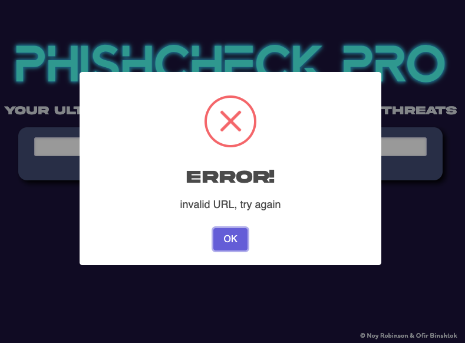

# Topics In Network Security - Chrome Extension Project

### About:
This is a chrome extension that anyone can install on their personal computer or by using the code files or by downloading the extension through the Chrome Webstore. 
The extension receives as an input a URL that the user gives it and returns an alert as to whether the URL is malicious or safe to open.

### Technologies:
* Virus total Api
* Sweet alert 2 JavaScript library.

### The Extension:

### Copyrights:
Noy Robinson & Ofir Binshtok.
